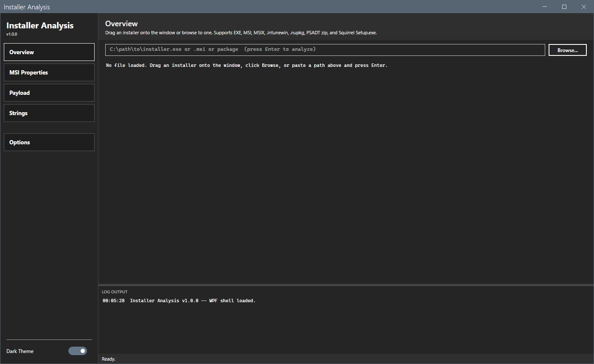

# Installer Analysis Tool

A Windows desktop tool for cracking open installer packages and pulling out
everything you need for MECM / Intune / Chocolatey packaging in one pass.
Covers classic EXE/MSI installers and modern package formats: MSIX/APPX
bundles, Intune `.intunewin`, Chocolatey / NuGet `.nupkg`, PSAppDeployToolkit
wrappers, and Squirrel / Electron `Setup.exe`.

Browse, paste a path, or drag-drop. Runs as the logged-in user (no admin
required), offline, with no MECM connection.


*Overview tab. Drop an installer to populate the analysis: type detection,
silent switches, deployment fields, file metadata, signature validation,
and the MECM-ready export action bar. Log drawer captures each analysis
pass; status bar reflects the resolved display name.*

## Requirements

- Windows 10 / 11
- PowerShell 5.1
- .NET Framework 4.7.2+
- 7-Zip (optional, for payload extraction)

No admin required. No NuGet. No runtime network pulls. Everything ships in
the zip: MahApps.Metro / ControlzEx / Microsoft.Xaml.Behaviors for the WPF
shell, plus the PSGallery `MSI` module (heaths/psmsi, MIT) for enhanced MSI
property extraction (`WindowsInstaller` COM fallback works too when the
vendored module can't load for any reason). All under `Lib/`.

## Install

Download the release zip, extract it, and run:

```powershell
powershell.exe -NoProfile -ExecutionPolicy Bypass -File install.ps1
```

This copies the application to `%LOCALAPPDATA%\InstallerAnalysis` and adds an
`Installer Analysis` shortcut to the Start Menu. No admin required.

To remove:

```powershell
powershell.exe -NoProfile -ExecutionPolicy Bypass -File uninstall.ps1
```

Add `-PurgeData` to remove logs and user prefs as well.

## Quick Start

Launch `Installer Analysis` from the Start Menu, then drag an installer
onto the window or browse to one. The Overview tab fills in immediately:
installer type, deployment fields (DisplayName, DisplayVersion, Publisher,
Silent Install / Uninstall), MSI properties if applicable, and format-specific
package metadata.

To run directly without installing:

```powershell
powershell.exe -NoProfile -ExecutionPolicy Bypass -STA -File start-installeranalysis.ps1
```

## Features

### Installer Type Detection

Binary signature and ZIP-layout scanning identify 18 installer / package
formats:

**Classic installers (EXE / MSI)**

| Type | Detection Method | Silent Install |
|---|---|---|
| MSI | OLE magic bytes / extension | `msiexec /i "file.msi" /qn /norestart` |
| NSIS | DEADBEEF + "NullsoftInst" | `/S` (case sensitive!) |
| Inno Setup | "Inno Setup" string | `/VERYSILENT /SUPPRESSMSGBOXES /NORESTART /SP-` |
| InstallShield | "InstallShield" string | `/s /v"/qn"` |
| WiX Burn | "WixBundleManifest" string | `/quiet /norestart` |
| 7-Zip SFX | 7z magic bytes | Extract first, then run embedded installer |
| WinRAR SFX | RAR magic bytes | Extract first, then run embedded installer |
| Advanced Installer | "Advanced Installer" string | `/i /qn` |
| BitRock InstallBuilder | "BitRock" string | `--mode unattended --unattendedmodeui none` |

**Package formats**

| Type | Detection Method | Silent Install |
|---|---|---|
| Chocolatey `.nupkg` | ZIP + root `.nuspec` + `tools/chocolatey*.ps1` | `choco install <id> --version=<ver> -y` |
| NuGet `.nupkg` | ZIP + root `.nuspec` (without Chocolatey tools) | `nuget install <id> -Version <ver> -Source <feed>` |
| Intune `.intunewin` | ZIP + `IntuneWinPackage/Metadata/Detection.xml` | Decrypted by Intune Management Extension; original setup switches preserved in Detection.xml |
| MSIX / APPX | ZIP + root `AppxManifest.xml` | `Add-AppxPackage -Path "<msix>"` |
| MSIX / APPX Bundle | ZIP + `AppxMetadata/AppxBundleManifest.xml` | `Add-AppxPackage -Path "<msixbundle>"` |
| PSADT v3 (zipped) | `Deploy-Application.ps1` + `AppDeployToolkit/AppDeployToolkitMain.ps1` | `Deploy-Application.exe -DeploymentType Install -DeployMode Silent` |
| PSADT v4 (zipped) | `Invoke-AppDeployToolkit.ps1` + `PSAppDeployToolkit/` module | `Invoke-AppDeployToolkit.exe -DeploymentType Install -DeployMode Silent` |
| Squirrel / Electron | Multiple lifecycle markers (`SquirrelTemp`, `squirrel-install`, etc.) in binary | `Setup.exe --silent` (double-dash, lowercase) |

### Version Intelligence

- **FileVersionInfo**: FileVersion, ProductVersion, CompanyName, FileDescription
- **PE Header**: architecture (x86, x64, ARM64)
- **Digital Signature**: status, signer subject, issuer, thumbprint
- **File Hash**: SHA-256

### Deployment Fields

Resolves the key Add/Remove Programs registry values (DisplayName,
DisplayVersion, Vendor, SilentUninstallString) from the best available source.
Package metadata takes precedence over MSI properties, which take precedence
over FileVersionInfo, with automatic fallback through the chain.

### MSI Properties

Full MSI Property table extraction using the PSGallery `MSI` module (preferred)
or COM interop fallback. Key properties: ProductName, ProductVersion,
ProductCode, UpgradeCode, Manufacturer. Summary Information stream provides
architecture (x86/x64 from Template property).

### Payload Extraction

Uses 7-Zip to list and extract contents from installer archives (NSIS, Inno,
7z SFX, etc.). Automatically detects embedded MSI files in EXE wrappers and
analyzes them.

### Package Metadata

For modern package formats, a dedicated metadata parser reads the manifest
file inside the archive and surfaces standardized fields (DisplayName,
DisplayVersion, Publisher, Architecture, ProductCode / PackageId, silent
install / uninstall commands) in the Overview tab. Format-specific extras:

- **Chocolatey / NuGet:** nuspec package id, project URL, authors, dependencies
- **Intune `.intunewin`:** Tool version, original setup file, full MsiInfo block when the source installer was an MSI (ProductCode, UpgradeCode, ExecutionContext, etc.)
- **MSIX / APPX:** Identity (Name, Publisher, Version, ProcessorArchitecture) + Properties.DisplayName / PublisherDisplayName
- **MSIX / APPX Bundle:** Inner packages enumerated with their architectures and resource IDs
- **PSADT:** Toolkit version (v3 or v4), per-app header (vendor, name, version, architecture, language, revision)
- **Squirrel / Electron:** Extracted AppName and Version from embedded `<name>-<version>-full.nupkg` reference, list of Squirrel lifecycle markers observed, confidence rating

### String Analysis

Scans binary for interesting strings categorized as: Installer Markers, URLs,
Registry Paths, File Paths, GUIDs, Version Strings. Real-time filter on the
Strings tab.

## User Interface

Sidebar nav selects one of four views of the same analysis; file-path input
and an action bar live above the view. One analysis pass fills every view.

- **Overview** -- all-in-one summary: file info, installer type, deployment fields, MSI properties (if MSI), package metadata (if MSIX / Intunewin / Chocolatey / PSADT / Squirrel), silent switches.
- **MSI Properties** -- full property table grid (populated for MSI files or embedded MSIs).
- **Payload** -- contents listing from 7z (populated for EXE-wrapped installers: NSIS, Inno, InstallShield, WiX Burn, SFX).
- **Strings** -- categorized interesting strings with a live case-insensitive filter.

The left sidebar is the four view buttons plus an **OPTIONS** button and the
dark / light theme toggle at the bottom. Analyze happens implicitly on drag-
drop, Browse, or pressing Enter in the file-path box; no separate Analyze
button is needed.

The content-area **action bar** (Copy Summary, Copy JSON, Export CSV, Export
HTML, Extract Payload) appears once an analysis completes; Extract Payload
only shows for 7-Zip-listable types.

The **Options window** has four panels: 7-Zip Path, Logging, Reports folder,
About. Theme is intentionally not in Options -- the toggle on the main
sidebar is the single source of truth.

A log drawer (resizable via splitter) surfaces the INFO / WARN / ERROR
stream from each analysis pass; the status bar below shows the current
resolved display name or the last action's result.

## Project Structure

```
installer-analysis/
|-- start-installeranalysis.ps1       # WPF shell
|-- install.ps1                       # copy to %LOCALAPPDATA% + Start Menu shortcut
|-- uninstall.ps1                     # reverse of install
|-- MainWindow.xaml                   # MahApps.Metro shell layout
|-- Lib/                              # vendored MahApps / ControlzEx / Xaml.Behaviors
|-- Module/
|   |-- InstallerAnalysisCommon.psd1  # module manifest
|   |-- InstallerAnalysisCommon.psm1  # cracker / analysis functions
|   |-- InstallerAnalysisCommon.Tests.ps1
|-- Logs/                             # per-session runtime logs (gitignored)
|-- Reports/                          # CSV / HTML exports (gitignored)
|-- CHANGELOG.md
|-- LICENSE
|-- README.md
```

## Tests

103 Pester 5.x tests covering logging, PE architecture detection, installer-
type detection (including the 18th BitRock format and Inno Setup past the
legacy 512KB scan boundary), ZIP helpers, MSI property extraction, per-
format cracker metadata, deployment-fields precedence, silent-switch
template expansion, per-format summary rendering, and the MECM-ready JSON
digest. No admin elevation, no real installer files, no network. Synthetic
ZIP-builder fixtures for every package format.

```powershell
Invoke-Pester .\Module\InstallerAnalysisCommon.Tests.ps1
```

## License

This project is licensed under the [MIT License](LICENSE).

## Author

Jason Ulbright
