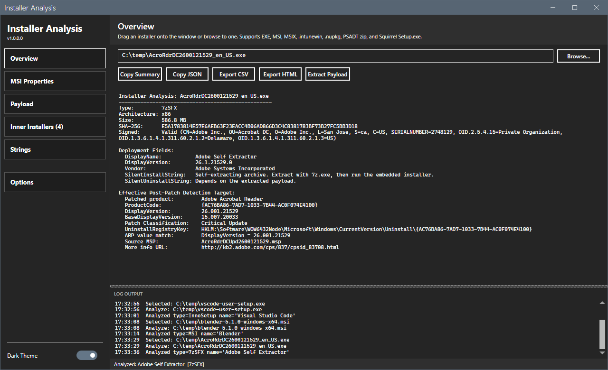
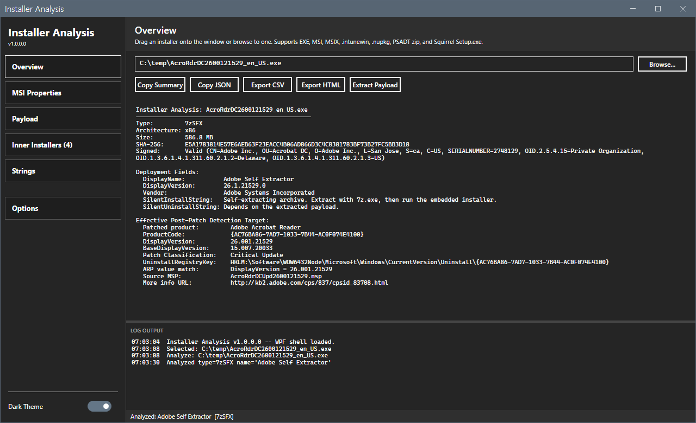

# Installer Analysis

Inspect a Windows installer and pull out the deployment data needed to
package it for MECM, Intune, or Chocolatey — in one pass, with no admin
rights, no network, and no MECM connection.

Drop an installer onto the window and the Overview tab fills in: detected
installer type, architecture, signature status, deployment fields
(DisplayName, DisplayVersion, Vendor, silent install / uninstall command
lines, predicted ARP key), and format-specific package metadata where the
installer carries it.

## Scope

This tool reads installer metadata only. It does not bypass product
licensing, generate or recover license keys, remove activation checks,
decrypt protected payloads (including `.intunewin` AES content), or
redistribute third-party installer content. It operates entirely
offline against installers the user already possesses.

Every extractor in this repository maps to a publicly documented
precedent on GitHub, usually owned by the format's vendor (Microsoft,
WiX Toolset, NuGet team, etc.) — see [SOURCES.md](SOURCES.md) for the
per-function precedent map.

## Installer formats detected

| Bucket          | Formats                                                            |
|-----------------|--------------------------------------------------------------------|
| Classic EXE     | NSIS, Inno Setup, InstallShield, WiX Burn, 7-Zip SFX, BitRock      |
| MSI family      | MSI, MSP (Windows Installer Patch)                                 |
| Modern packages | MSIX / APPX (+ bundles), `.intunewin`, Chocolatey / NuGet `.nupkg` |
| Script wrappers | PSAppDeployToolkit v3 + v4, Squirrel / Electron                    |

Type detection is binary-signature + ZIP-layout driven, not extension-
guessing.

## What's in the Overview

Every analysis surfaces:

- **Source facts** — type, architecture, size, SHA-256, Authenticode
  signature with signer subject.
- **Deployment fields** — DisplayName, DisplayVersion, Vendor, silent
  install / uninstall command lines, predicted `UninstallRegistryKey`
  (the ARP key the installer writes to, with WOW6432Node routing for
  32-bit MSIs on x64 and HKCU routing for per-user installs).
- **MSI properties** — for MSI files or EXE wrappers with an embedded
  MSI: ProductCode, UpgradeCode, ProductVersion, Manufacturer, plus the
  full Property table.
- **Package metadata** — format-specific block per detected type
  (nuspec for `.nupkg`, AppxManifest for MSIX, MsiPatchMetadata for MSP,
  `.wixburn` PE section for WiX Burn, etc.). `.intunewin` AES key
  material (EncryptionKey, MacKey, IV, Mac) is redacted by default;
  pass `-IncludeIntunewinKeyMaterial` to `Get-IntunewinMetadata` if you
  need the raw values.
- **Effective post-patch detection target** — for outer files that
  contain a base MSI plus a cumulative MSP (Adobe Reader, Office, most
  enterprise vendors), the analyzer combines the inner MSI's ProductCode
  with the MSP's `MsiPatchMetadata.DisplayName` to render the ARP key
  and DisplayVersion the patched product will actually write — so
  detection methods can be authored without installing the product.

## Inner Installers

A dedicated tab classifies the installer-class entries inside the
current file's payload (inner MSIs / MSPs / sub-EXEs / `.nupkg` / Media-
table CABs). Pick a row and click **Analyze Selected** to drill into it:
the analyzer extracts the entry to a sandboxed temp folder, re-runs the
full pipeline on it, and surfaces a breadcrumb bar with `← Back` plus
clickable ancestor segments. **Open in new window** spawns a sibling
analyzer process so you can compare the outer and inner side-by-side.
Drill depth caps at 5. Temp folder is wiped on shell close.

## Right-click

Every grid row has a context menu. Payload + Inner Installers grids:
Extract to temp folder, Copy name, Copy full path, Hash (SHA-256).
Inner Installers also has Analyze Selected and Open in new window. The
path TextBox keeps the standard Cut / Copy / Paste / Select All and
adds Copy path, Open enclosing folder, and Re-analyze.

## Export

- **Copy Summary** — clipboard, plain text, paste-ready for a ticket
  or change record.
- **Copy JSON** — clipboard, MECM-ready JSON digest with detection
  hints keyed to installer type.
- **Export CSV** / **Export HTML** — file output of the full analysis
  table.
- **Extract Payload** — full 7-Zip extraction of the installer
  contents to a folder of your choice.

## Requirements

- Windows 10 or 11
- Windows PowerShell 5.1
- .NET Framework 4.7.2 or later
- 7-Zip (optional, for payload listing and Inner Installers; the rest of
  the analysis runs without it)

No admin required. No network. Everything ships in the zip:
MahApps.Metro / ControlzEx / Microsoft.Xaml.Behaviors for the WPF shell,
plus the PSGallery `MSI` module (heaths/psmsi, MIT) for enhanced MSI
property extraction with a `WindowsInstaller` COM fallback when the
vendored module can't load.

## License

MIT.
