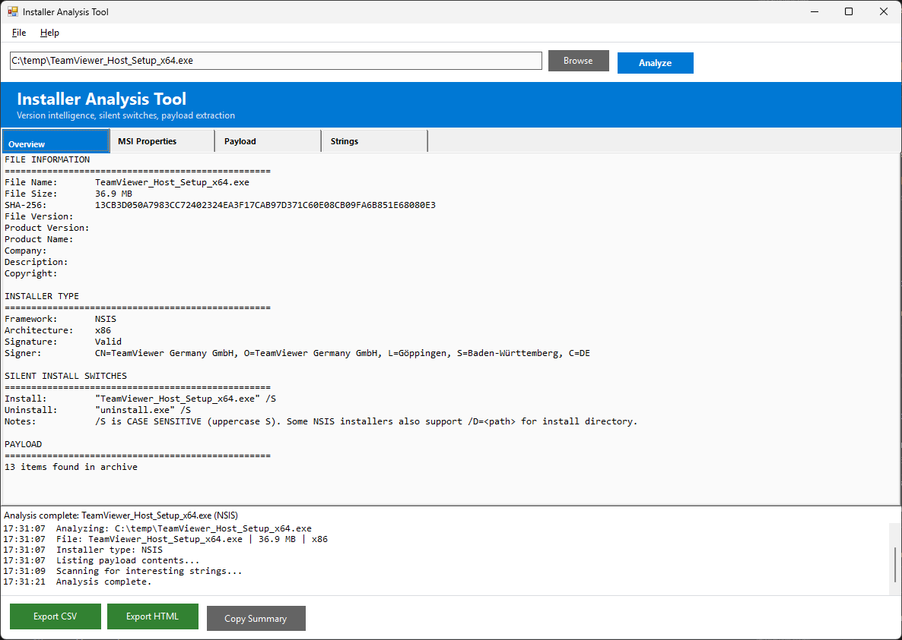
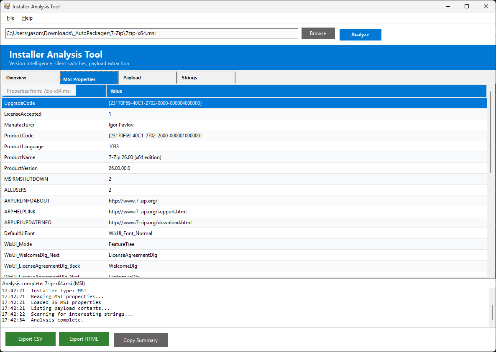
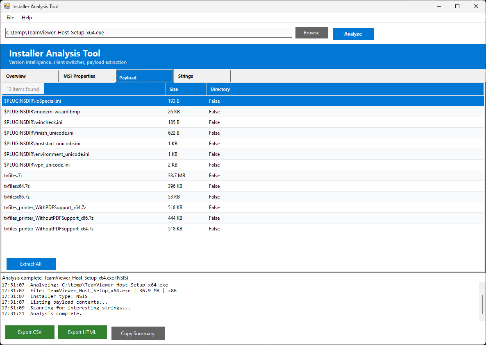
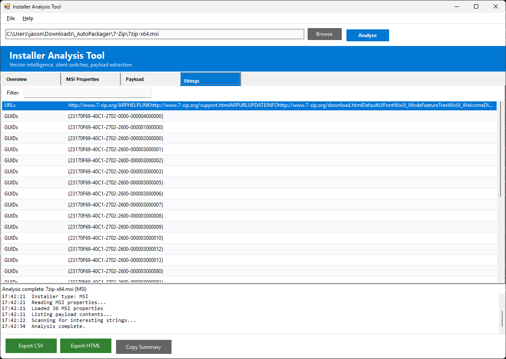

# Installer Analysis Tool

A WinForms-based PowerShell GUI for analyzing EXE and MSI installer files. Point it at an installer, get everything you need for MECM packaging in one pass: installer type, version, architecture, product codes, silent install switches, payload contents, and binary strings.

Supports drag-and-drop. No MECM connection required.

## Screenshots


*Overview tab showing file info, installer type detection, digital signature, and silent install switches for an NSIS installer.*


*MSI Properties tab with full property table: ProductCode, UpgradeCode, ProductVersion, Manufacturer, and more.*


*Payload tab listing archive contents extracted via 7-Zip, with file sizes and an Extract All button.*


*Strings tab showing categorized binary strings (URLs, GUIDs) with real-time filter.*

## Requirements

- Windows 10/11
- PowerShell 5.1
- .NET Framework 4.8+
- 7-Zip (optional, for payload extraction)
- PSGallery MSI module (optional, for enhanced MSI analysis: `Install-Module MSI`)

## Quick Start

```powershell
powershell -ExecutionPolicy Bypass -File start-installeranalysis.ps1
```

Browse to an installer or drag-drop a file onto the window.

## Features

### Installer Type Detection

Binary signature scanning detects the installer framework:

| Type | Detection Method | Silent Install |
|---|---|---|
| MSI | OLE magic bytes / extension | `msiexec /i "file.msi" /qn /norestart` |
| NSIS | DEADBEEF + "NullsoftInst" | `/S` (case sensitive!) |
| Inno Setup | "Inno Setup" string | `/VERYSILENT /SUPPRESSMSGBOXES /NORESTART /SP-` |
| InstallShield | "InstallShield" string | `/s /v"/qn"` |
| WiX Burn | "WixBundleManifest" string | `/quiet /norestart` |
| 7-Zip SFX | 7z magic bytes | Extract first, then run embedded installer |
| WinRAR SFX | RAR magic bytes | Extract first, then run embedded installer |
| Advanced Installer | "Advanced Installer" string | `/i /qn` |

### Version Intelligence

- **FileVersionInfo**: FileVersion, ProductVersion, CompanyName, FileDescription
- **PE Header**: architecture (x86, x64, ARM64)
- **Digital Signature**: status, signer subject, issuer, thumbprint
- **File Hash**: SHA-256

### MSI Properties

Full MSI Property table extraction using the PSGallery `MSI` module (preferred) or COM interop fallback. Key properties: ProductName, ProductVersion, ProductCode, UpgradeCode, Manufacturer.

Summary Information stream provides architecture (x86/x64 from Template property).

### Payload Extraction

Uses 7-Zip to list and extract contents from installer archives (NSIS, Inno, 7z SFX, etc.). Automatically detects embedded MSI files in EXE wrappers and analyzes them.

### String Analysis

Scans binary for interesting strings categorized as: Installer Markers, URLs, Registry Paths, File Paths, GUIDs, Version Strings. Real-time filter on the Strings tab.

## Tabs

- **Overview** -- all-in-one summary: file info, installer type, MSI properties, silent switches
- **MSI Properties** -- full property table grid (populated for MSI files or embedded MSIs)
- **Payload** -- contents listing from 7z with Extract All button
- **Strings** -- categorized interesting strings with filter

## Project Structure

```
installeranalysis/
├── start-installeranalysis.ps1                # WinForms GUI
├── Module/
│   ├── InstallerAnalysisCommon.psd1           # Module manifest
│   ├── InstallerAnalysisCommon.psm1           # Business logic (18 functions)
│   └── InstallerAnalysisCommon.Tests.ps1      # Pester 5.x tests (30 tests)
├── Logs/
├── Reports/
├── CHANGELOG.md
├── LICENSE
└── README.md
```

## Tests

30 Pester 5.x tests. No admin elevation or real installer files required (uses synthetic test data).

```powershell
cd Module
Invoke-Pester .\InstallerAnalysisCommon.Tests.ps1
```

## License

This project is licensed under the [MIT License](LICENSE).

## Author

Jason Ulbright
